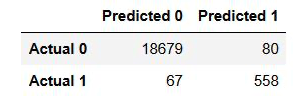
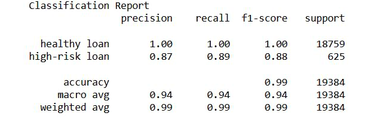
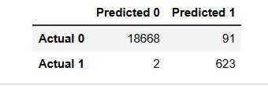
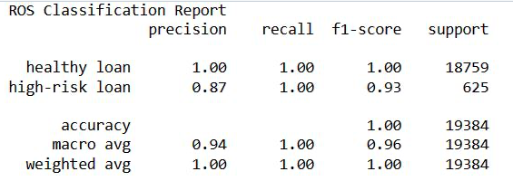

# Introduction
Utilize diverse methodologies to train and assess a predictive model centered on loan risk. Employ a dataset comprising historical lending transactions sourced from a peer-to-peer lending services provider to develop a model capable of discerning the creditworthiness of potential borrowers.

## Findings
### Logistic Regression Model with the Original Data:

* Precision assesses the ratio of accurately predicted instances to the total predicted instances for a given label. In the context of the "healthy loan" class, precision is perfect at 1.00, indicating flawless predictions for this label. Conversely, for the "high-risk loan" class, precision stands at 0.87, signifying that 87% of the predicted high-risk loans are accurate.

* Recall, alternatively termed sensitivity or true positive rate, gauges the ratio of accurately predicted instances to the total actual instances for a given label. In the case of the "healthy loan" class, recall attains a perfect score of 1.00, denoting the model's ability to capture all actual healthy loans. Conversely, for the "high-risk loan" class, the recall stands at 0.89, indicating that the model correctly identifies 89% of the high-risk loans.

* The F1-score, serving as the average of precision and recall, offers a balanced assessment of the model's effectiveness. In the context of the "healthy loan" class, the F1-score reaches a flawless 1.00, signifying impeccable performance. As for the "high-risk loan" class, the F1-score stands at 0.88, showcasing a commendable equilibrium between precision and recall for this category.

* The accuracy score is 99%, this model performs exceptionally well.

* An enhancement opportunity lies in reducing the count of 'False Negative' instances, currently at 67. Lowering this value is crucial, especially in scenarios like identifying potential high-risk loans or detecting fraudulent activities, where false negatives can lead to missed opportunities. By minimizing false negatives, we enhance our ability to accurately identify positive instances, empowering us to take necessary actions and capitalize on these opportunities effectively.

### Logistic Regression Model with with Resampled Training Data:

* FThe precision for the "healthy loan" class is 1.00, indicating perfect precision in predicting this label. In contrast, for the "high-risk loan" class, the precision is 0.87, meaning that 87% of the predicted high-risk loans are accurate.

* The recall for both the "healthy loan" and "high-risk loan" classes is 1.00, indicating that the model successfully captures all actual instances of both classes.
  
* For the "healthy loan" class, the F1-score is 1.00, demonstrating outstanding performance. In the case of the "high-risk loan" class, the F1-score is 0.93, indicating a solid balance between precision and recall for this label.

* The accuracy score is 100%, this model performs very well.

* This model successfully reduced the count of False Negatives from 67 down to 2, a remarkable achievement that I am highly pleased with. This significant decrease enhances our ability to accurately identify positive instances, enabling us to take timely and appropriate actions, particularly in identifying potential high-risk loans or detecting fraudulent activities. False negatives can lead to inefficient resource allocation when necessary actions, investigations, or interventions are not undertaken when they should be. By minimizing false negatives, we can optimize the allocation of resources, directing efforts towards instances that genuinely require attention.

Furthermore, false negatives can undermine trust in the predictive model or system. Consistent encounters with false negatives may diminish users' confidence in the model's capacity to accurately identify positive instances. This erosion of trust could have adverse effects on the reputation and adoption of the model or system. Therefore, by striving to minimize false negatives, we can bolster the reliability and credibility of the predictions, cultivating trust among users.

## Conclusion
Considering the outlined factors, the "logistic regression model fit with oversampled data" is preferred over the "logistic regression model fit with the original data." The model trained with oversampled data demonstrates enhanced performance in accurately identifying instances of the "high-risk loan" class, resulting in elevated recall and F1-score metrics. Moreover, the reduction in false negatives is pivotal for effectively identifying high-risk loans and mitigating potential risks. Therefore, the logistic regression model trained with oversampled data offers improved performance and reliability compared to the model trained with the original data.

